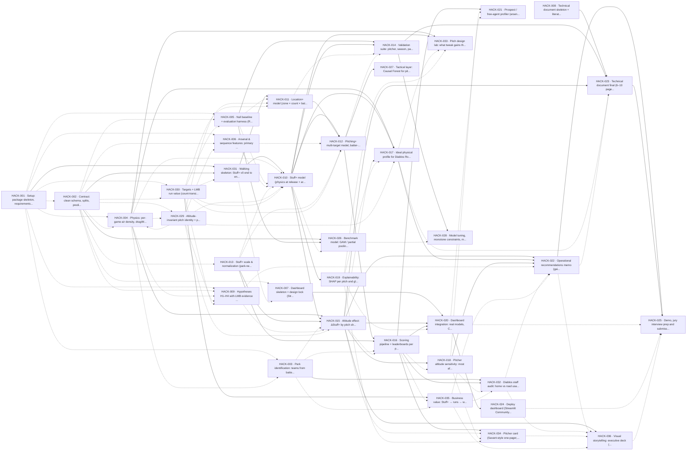

```mermaid
flowchart LR
  HACK_001["HACK-001 · Setup: package skeleton, requirements..."]
  HACK_002["HACK-002 · Contract: clean schema, splits, predi..."]
  HACK_030["HACK-030 · Targets + LMB run value (count-transi..."]
  HACK_031["HACK-031 · Walking skeleton: Stuff+ v0 end to en..."]
  HACK_003["HACK-003 · Park identification: teams from batte..."]
  HACK_004["HACK-004 · Physics: per-game air density, drag/M..."]
  HACK_005["HACK-005 · Null baseline + evaluation harness (R..."]
  HACK_006["HACK-006 · Arsenal & sequence features: primary ..."]
  HACK_029["HACK-029 · Altitude-invariant pitch identity + p..."]
  HACK_007["HACK-007 · Dashboard skeleton + design lock (Str..."]
  HACK_008["HACK-008 · Technical document skeleton + literat..."]
  HACK_009["HACK-009 · Hypotheses H1–H4 with LMB evidence ..."]
  HACK_013["HACK-013 · Stuff+ scale & normalization (park-ne..."]
  HACK_010["HACK-010 · Stuff+ model (physics at release + ar..."]
  HACK_011["HACK-011 · Location+ model (zone × count × bat..."]
  HACK_012["HACK-012 · Pitching+ multi-target model, batter-..."]
  HACK_014["HACK-014 · Validation suite: pitcher, season, pa..."]
  HACK_015["HACK-015 · Altitude effect: ΔStuff+ by pitch sh..."]
  HACK_016["HACK-016 · Scoring pipeline + leaderboards per p..."]
  HACK_017["HACK-017 · Ideal physical profile for Diablos Ro..."]
  HACK_018["HACK-018 · Pitcher altitude sensitivity: most af..."]
  HACK_019["HACK-019 · Explainability: SHAP per pitch and gl..."]
  HACK_020["HACK-020 · Dashboard integration: real models, C..."]
  HACK_021["HACK-021 · Prospect / free-agent profiler (arsen..."]
  HACK_032["HACK-032 · Diablos staff audit: home vs road usa..."]
  HACK_033["HACK-033 · Pitch design lab: what tweak gains th..."]
  HACK_034["HACK-034 · Pitcher card (Savant-style one-pager,..."]
  HACK_035["HACK-035 · Business value: Stuff+ → runs → w..."]
  HACK_022["HACK-022 · Operational recommendations memo (gai..."]
  HACK_023["HACK-023 · Technical document final (6–10 page..."]
  HACK_036["HACK-036 · Visual storytelling: executive deck (..."]
  HACK_024["HACK-024 · Deploy dashboard (Streamlit Community..."]
  HACK_025["HACK-025 · Demo, jury interview prep and submiss..."]
  HACK_026["HACK-026 · Benchmark model: GAM / partial poolin..."]
  HACK_027["HACK-027 · Tactical layer: Causal Forest for pit..."]
  HACK_028["HACK-028 · Model tuning, monotone constraints, m..."]
  HACK_001 -.-> HACK_002
  HACK_001 -.-> HACK_030
  HACK_002 -.-> HACK_030
  HACK_001 --> HACK_031
  HACK_002 --> HACK_031
  HACK_030 -.-> HACK_031
  HACK_001 -.-> HACK_003
  HACK_004 -.-> HACK_003
  HACK_001 -.-> HACK_004
  HACK_002 -.-> HACK_004
  HACK_029 -.-> HACK_004
  HACK_001 -.-> HACK_005
  HACK_002 -.-> HACK_005
  HACK_030 -.-> HACK_005
  HACK_001 -.-> HACK_006
  HACK_002 -.-> HACK_006
  HACK_029 -.-> HACK_006
  HACK_002 -.-> HACK_029
  HACK_004 -.-> HACK_029
  HACK_002 -.-> HACK_007
  HACK_031 -.-> HACK_007
  HACK_001 -.-> HACK_009
  HACK_002 -.-> HACK_009
  HACK_004 -.-> HACK_009
  HACK_029 -.-> HACK_009
  HACK_030 -.-> HACK_009
  HACK_002 -.-> HACK_013
  HACK_031 --> HACK_010
  HACK_004 -.-> HACK_010
  HACK_005 -.-> HACK_010
  HACK_006 -.-> HACK_010
  HACK_013 -.-> HACK_010
  HACK_029 -.-> HACK_010
  HACK_030 -.-> HACK_010
  HACK_031 --> HACK_011
  HACK_005 -.-> HACK_011
  HACK_029 -.-> HACK_011
  HACK_030 -.-> HACK_011
  HACK_010 --> HACK_012
  HACK_011 --> HACK_012
  HACK_006 -.-> HACK_012
  HACK_013 -.-> HACK_012
  HACK_030 -.-> HACK_012
  HACK_005 --> HACK_014
  HACK_010 --> HACK_014
  HACK_011 -.-> HACK_014
  HACK_012 -.-> HACK_014
  HACK_004 --> HACK_015
  HACK_010 --> HACK_015
  HACK_013 --> HACK_015
  HACK_003 -.-> HACK_015
  HACK_009 -.-> HACK_015
  HACK_029 -.-> HACK_015
  HACK_012 --> HACK_016
  HACK_013 --> HACK_016
  HACK_003 -.-> HACK_016
  HACK_015 -.-> HACK_016
  HACK_004 --> HACK_017
  HACK_010 --> HACK_017
  HACK_015 -.-> HACK_017
  HACK_019 -.-> HACK_017
  HACK_029 -.-> HACK_017
  HACK_015 --> HACK_018
  HACK_016 -.-> HACK_018
  HACK_010 --> HACK_019
  HACK_007 --> HACK_020
  HACK_015 --> HACK_020
  HACK_016 --> HACK_020
  HACK_019 -.-> HACK_020
  HACK_016 --> HACK_021
  HACK_018 -.-> HACK_021
  HACK_020 -.-> HACK_021
  HACK_003 --> HACK_032
  HACK_016 --> HACK_032
  HACK_018 -.-> HACK_032
  HACK_035 -.-> HACK_032
  HACK_004 --> HACK_033
  HACK_010 --> HACK_033
  HACK_017 -.-> HACK_033
  HACK_019 -.-> HACK_033
  HACK_016 --> HACK_034
  HACK_015 -.-> HACK_034
  HACK_018 -.-> HACK_034
  HACK_019 -.-> HACK_034
  HACK_030 --> HACK_035
  HACK_016 -.-> HACK_035
  HACK_003 -.-> HACK_035
  HACK_015 --> HACK_022
  HACK_017 --> HACK_022
  HACK_018 --> HACK_022
  HACK_009 -.-> HACK_022
  HACK_032 -.-> HACK_022
  HACK_035 -.-> HACK_022
  HACK_008 --> HACK_023
  HACK_014 --> HACK_023
  HACK_015 --> HACK_023
  HACK_017 -.-> HACK_023
  HACK_022 -.-> HACK_023
  HACK_015 --> HACK_036
  HACK_022 -.-> HACK_036
  HACK_032 -.-> HACK_036
  HACK_034 -.-> HACK_036
  HACK_035 -.-> HACK_036
  HACK_020 --> HACK_024
  HACK_022 --> HACK_025
  HACK_023 --> HACK_025
  HACK_020 -.-> HACK_025
  HACK_024 -.-> HACK_025
  HACK_036 -.-> HACK_025
  HACK_002 --> HACK_026
  HACK_005 --> HACK_026
  HACK_010 -.-> HACK_026
  HACK_012 --> HACK_027
  HACK_014 --> HACK_028
  HACK_026 -.-> HACK_028
  classDef integrated fill:#d1fadf,stroke:#16a34a
  classDef claimed fill:#dbeafe,stroke:#2563eb
  classDef review fill:#fef9c3,stroke:#ca8a04
  classDef blocked fill:#fee2e2,stroke:#dc2626
```
